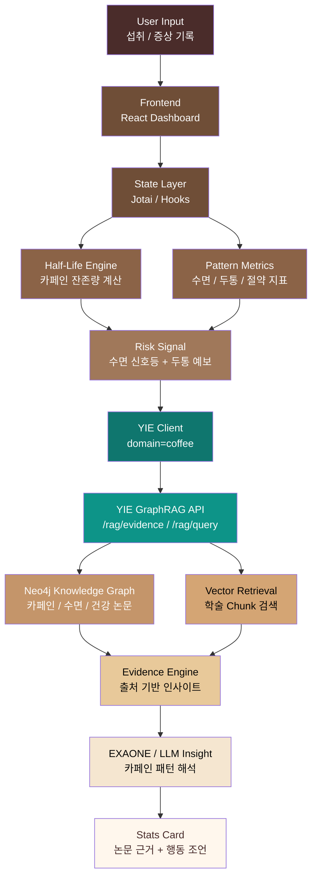
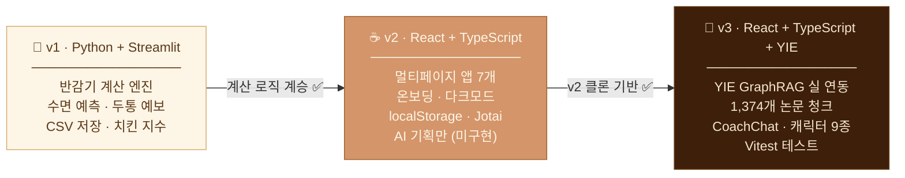

# ☕ Cof/fee v3


> **"오늘 마신 커피가 내일의 두통이 되지 않게."**  
> 카페인 주기 계산기 & 스마트 디톡스 매니저 — **YIE 통합 버전**


---

## 🎯 프로젝트 정체성 (Identity)

- **핵심 가치:** 양(Quantity) 조절 + 시간(Time) 관리 = 부작용 없는 건강한 커피 생활
- **슬로건:** 카페인, 마시는 시간까지 관리해야 진짜다.
- **핵심 타겟:** 카페인 중독으로 인한 두통(금단 현상)을 예방하고, 안전하게 커피를 즐기고 싶은 모든 사용자

> ✅ **v3 YIE 연동 구현 완료**
>
> Stats 화면에서 카페인 패턴에 대한 논문 기반 인사이트를 확인할 수 있습니다.

---

## ✨ 핵심 기능 (Core Features)

| 기능 | 상세 내용 | 비유 및 로직 |
|---|---|---|
| 스마트 기록기 | 브랜드/메뉴별 카페인 자동 계산 및 마신 시간 정밀 기록 | 📸 찰칵! 마신 시간 저장하기 |
| 실시간 잔존량 | 반감기 로직을 적용해 체내 카페인 농도 시각화 | ⏳ 시간이 흐를수록 줄어드는 모래시계 |
| 두통 예보 | 마지막 섭취 후 12~24시간 뒤 금단 증상 위험 시간 알림 | ☔️ 비 오기 전 우산을 챙기듯 두통 대비 |
| 수면 신호등 | 카페인 농도에 따른 수면 가능 여부 시각화 (🟢/🟡/🔴) | 🛌 지금 자면 꿀잠잘 수 있을까? |
| 리액션 콩 | 카페인 수치에 따른 캐릭터의 4단계 상태 변화 및 조언 | 🥜 콩: "지금 마시면 밤에 잠 못 잔다구!" |
| 치킨 지수 | 커피를 참아 아낀 돈을 '치킨 마리 수'로 환산 | 🍗 커피 10잔 참으면 치킨 한 마리 득템! |
| **논문 기반 인사이트** ✨ NEW | YIE GraphRAG 엔진 기반 카페인·수면·건강 학술 근거 카드 | 🧠 1,374개 논문 청크에서 뽑은 실제 근거 |

---

## 📉 핵심 알고리즘 (Algorithm)

본 서비스는 카페인 반감기($halfLife \approx 5$시간)를 기반으로 체내 잔존량을 계산합니다.

$$C_{now} = C_{initial} \times 0.5^{\frac{t}{halfLife}}$$

- $C_{now}$: 현재 체내 잔존량  
- $C_{initial}$: 초기 섭취량  
- $t$: 섭취 후 경과 시간

---

## 🧠 v3 신규: YIE GraphRAG 연동

Cof/fee v3는 **Universal Insight Engine(YIE)** 에 연결되어, 단순 수치 계산을 넘어 **논문 기반 인사이트**를 제공합니다.

```
Cof/fee v3 ──(HTTP)──▶ YIE /rag/query (domain=coffee)
                              │
                         Neo4j GraphRAG
                         1,374개 학술 청크
                         (카페인·수면·인지·피로 논문)
```

- **Stats 화면**: "논문 기반 패턴 해석" 카드 — 사용자 카페인 패턴을 학술 근거로 해석
- **도메인 격리**: YIE 응답은 coffee 도메인 언어만 사용 (디자인/브랜드 언급 없음)

---

## 🧠 System Architecture



---

## 🛠️ 기술 스택 (Tech Stack)

**Frontend:** React, TypeScript, Vite  
**Styling:** Tailwind CSS  
**State Management:** Jotai  
**Visualization:** Recharts  
**Date Library:** Day.js  
**AI Engine:** YIE (Universal Insight Engine) — Neo4j GraphRAG + EXAONE 3.5

---

## 📂 프로젝트 구조 (Project Structure)

```
cof-fee-v3/
└── cof-fee/
    └── src/
        ├── assets/          # 콩 캐릭터 상태별 이미지, 아이콘
        ├── components/      # UI 컴포넌트
        ├── hooks/           # 반감기·카페인 계산 로직
        ├── lib/             # 상수, 유틸, 카페인 데이터
        └── pages/
            ├── Dashboard/   # 메인 대시보드
            ├── Stats/       # 통계 + YIE 인사이트 카드 (v3 신규)
            ├── History/     # 섭취 기록
            ├── Goals/       # 목표 관리
            └── Settings/    # 설정
```
---

## 🧬 Version History
 
> 반감기 계산기 스크립트 하나에서, AI 카페인 코칭 시스템으로.
 

 
> 전체 변천사 → [`cof-fee_변천사.md`](./docs/cof-fee_변천사.md)
>
> > 📦 [v1 · cof-fee](https://github.com/hoilycat/cof-fee) · [v2 · cof-fee-v2](https://github.com/hoilycat/cof-fee-v2) · v3 · 현재


---

## 🧭 Roadmap

- [x] 카페인 반감기 기반 잔존량 계산 엔진
- [x] 실시간 수면 신호등 & 두통 예보
- [x] 리액션 콩 캐릭터 시스템
- [ ] YIE `/rag/evidence` 연동 — 논문 기반 인사이트 카드 (Stats 화면) 👈 Current
- [x] YIE `/rag/query` 연동 — 카페인 패턴 AI 해석
- [ ] UI 리디자인 (v3 전용)

---

## 🌌 Credits

Designed & Developed by 용용  
감각적 사고 + 논리적 구조를 사랑하는 디자이너/메이커.


---

## 🫘 캐릭터 소개

| zen_bean | hustle_bean | spark_bean | pro_bean |
|:---:|:---:|:---:|:---:|
|  |  |  |  |

| coach_kong | funnybeen | relaxbeen | busybeen | composedbeen |
|:---:|:---:|:---:|:---:|:---:|
|  |  |  |  |  |
